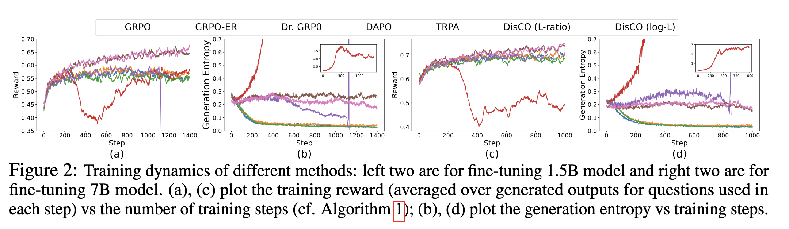

<h1 align="center">🚀 DisCO: Reinforcing Large Reasoning Models with Discriminative Constrained Optimization</h1>
<p align="center"></p>


The success of **DeepSeek-R1** has spotlighted **GRPO (Group Relative Policy Optimization)** as a key reinforcement learning method for large reasoning models.
However, GRPO suffers several key limitations including entropy collapse, difficulty bias, etc. 

*How can we design more effective optimization methods for reinforcing large reasoning models
in a principled manner without inheriting the limitations of GRPO?*


We analyzed GRPO under a binary reward setting and uncovered two core insights:

* ⚠️ GRPO suffers from **question-level difficulty bias**
* 🔍 GRPO has a surprising connection to **discriminative learning** techniques, particularly AUC maximization

---

### 💡 Introducing **DisCO** — *Discriminative Constrained Optimization*

**DisCO** is a new RL framework grounded in **discriminative learning**. It trains models by **increasing scores for positive answers while decreasing those for negatives**, enabling:

* ⚡ Faster convergence
* 🔒 More stable optimization
* 🔁 Long-lasting training dynamics for large reasoning models

---

### 🔍 Why DisCO?

* ❌ **No more difficulty bias** – replaces group-relative objective with discriminative objectives
* 🔄 **No clipping operations** – uses non-clipping scoring functions for smoother learning
* 📉 **Stable training** – via simple constrained optimization to keep KL divergence in check
* ⚖️ **Handles sparse rewards** – robust to imbalanced data with advanced discriminative approaches

---

### 📈 Quick Results

On six math reasoning benchmarks with a 1.5B model, **DisCO outperforms GRPO and its variants**:

* **+7% vs GRPO**
* **+6% vs DAPO**

**DisCO with 8k response length is on par or even better than GRPO with 32k response length**

---

- [More Results](#more-results)
- [Getting Started](#getting-started)
    - [Environment Setup](#environment-setup)
    - [Training](#training)
    - [Evaluation](#evaluation)
- [Citing DisCO](#citing-disco)

## More Results

Comparison with baseline models and baseline methods for fine-tuning 1.5B models. OpenAI-o1-preview is included as a reference.  MRL denotes Max Response Length utilized in training/testing. The shaded models are trained by other works and the shaded numbers are reported in their original works or in DeepScalaR. All other results are either evaluated on existing models or on the models trained by us using  different approaches. Methods in the bottom area are all for fine-tuning  DeepSeek-R1-Distill-Qwen-1.5B model on the same DeepScaleR dataset. DS is short for DeepSeek-R1, DSR is short for DeepScalaR.

<p align="center"></p>


Comparison with baseline models and baseline methods for fine-tuning 7B models. Methods in the bottom area are all for fine-tuning  DeepSeek-R1-Distill-Qwen-7B model on the the same DeepScalaR dataset.

<p align="center"></p>

Training dynamics of different methods: left two are for fine-tuning 1.5B model and right two are for fine-tuning 7B model. (a), (c) plot the training reward (averaged over generated outputs for questions used in each step) vs the number of training steps (cf. Algorithm~\ref{alg:disco}); (b), (d) plot the generation entropy vs training steps.

<p align="center"></p>


## Getting Started

## Citing DisCO

If you find DisCO useful in your research, please consider citing the following paper:
```bibtex
@article{li2025disco,
  title={DisCO: Reinforcing Large Reasoning Models with Discriminative Constrained Optimization},
  author={Li, Gang and Lin, Ming and Galanti, Tomer and Tu, Zhenzhong and Yang, Tianbao},
  journal={arXiv preprint arXiv},
  year={2025}
```

